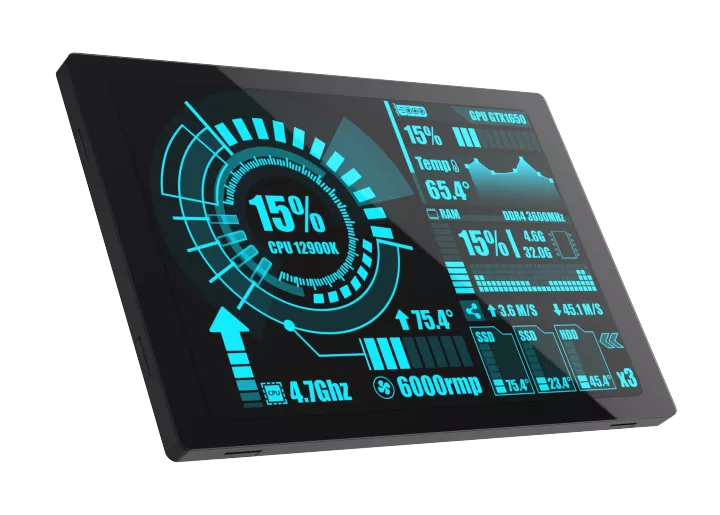

# BSP: SC01 Plus board 

* [Hardware Reference](http://www.wireless-tag.com/wp-content/uploads/2022/11/WT32-SC01-Plus-V1.3-EN.pdf)

This is an example how to make custom BSP and generate custom board for SquareLine Studio.

SC01 Plus 3.5inch Capacitive Touch LCD (C) 320x480

* INTERFACE: 8080 series interface
* LCD CONTROLLER: ST7796U
* TOUCH CONTROLLER: FT6336
* RESOLUTION: 320 * 480 (Pixel)

## Default Hardware Connection

### PARALLEL INTEL 8080 Display

| Display |    ESP32-S3   |
| :-----: | :-----------: |
|   CS    |     **GND**   |
| RS/DC   |   GPIO 0      |
|   WR    |   GPIO 47     |
|   RD    |    **3V3**    |
|   RST   |   GPIO 4      |
|   PS    |    **GND**    |
|   TE    |   GPIO 48     |
|   D0    |   GPIO 9      |
|   D1    |   GPIO 46     |
|   D2    |   GPIO 3      |
|   D3    |   GPIO 8      |
|   D4    |   GPIO 18     |
|   D5    |   GPIO 17     |
|   D6    |   GPIO 16     |
|   D7    |   GPIO 15     |
| D8 ~ D15|    **GND**    |

### I2C Touch

| Display |    ESP32-S3   |
| :-----: | :-----------: |
|   SCL   |   GPIO 5      |
|   SDA   |   GPIO 6      |
|   INT   |   GPIO 7      |
|   RST   |   GPIO 4      |
