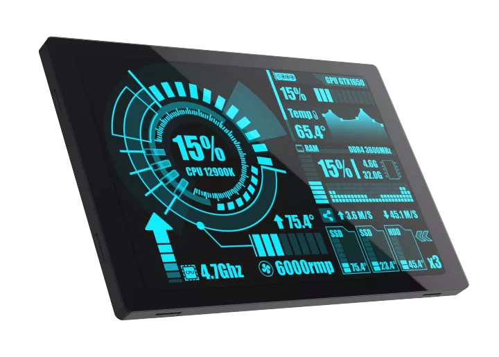

# BSP: WT32-SC01 Plus board 

This is an example how to make custom BSP and generate custom board for SquareLine Studio.

WT32-SC01 Plus is an ESP32 Development board with a 3.5-inch color touch screen. The touch screen enables a new way of interacting with the ESP32. The board is equipped with a graphical user interface (GUI) firmware, which supports graphical drag-and-drop programming and helps users develop a customized control platform.

WT32-SC01 Plus development board has the ESP32-S3-WROVER-N16R2 module, which is a general-purpose MCU module with Wi-Fi, Bluetooth, 16MB SPI Flash and 2MB PSRAM.

More information is available in the website of [Wireless Tag](https://en.wireless-tag.com/product-item-26.html).

* MODULE: WT32-S3-WROVER-N16R2
* HARDWARE INTERFACE: 
    - Debug
    - uSD card
    - Speaker
    - LCD: ST7796U, resolution 320 * 480 (Pixel), interface 8080 series
    - Capacitive touch: FT6336, interface i2c
    - RS485
    - Extended I/O
    - USB

## Interface Description:

### [1] Debug Interface (Tab. 1)

| Pin  | Description | Module Pin | Voltage Range | Remark                            |
| ---- | ----------- | ---------- | ------------- | --------------------------------- |
| 1    | +5V         | -          | 5V            |                                   |
| 2    | +3.3V       | -          | 3.3V          | For reference, not forpower input |
| 3    | ESP_TXD     | TXD0       |               |                                   |
| 4    | ESP_RXD     | RXD0       |               |                                   |
| 5    | EN          | EN         |               | Chip enable                       |
| 6    | BOOT        | GPIO 0     |               |                                   |
| 7    | GND         | GND        | 0V            | Ground                            |

### [2] Extended IO Interface (Tab. 2)

| Pin  | Description | Module Pin | Voltage Range | Remark                         |
| ---- | ----------- | ---------- | ------------- | ------------------------------ |
| 1    | +5V         | -          | 5V±5%         | Power supply or output voltage |
| 2    | GND         | GND        | 0V            | Ground                         |
| 3    | EXT_IO1     | GPIO 10    | 0-3.3V        | Extended IO                    |
| 4    | EXT_IO2     | GPIO 11    | 0-3.3V        | Extended IO                    |
| 5    | EXT_IO3     | GPIO 12    | 0-3.3V        | Extended IO                    |
| 6    | EXT_IO4     | GPIO 13    | 0-3.3V        | Extended IO                    |
| 7    | EXT_IO5     | GPIO 14    | 0-3.3V        | Extended IO                    |
| 8    | EXT_IO6     | GPIO 21    | 0-3.3V        | Extended IO                    |

### [3] Speaker Connector (Tab.3)

| Pin  | Description | Remark           |
| ---- | ----------- | ---------------- |
| 1    | SPK+        | Speaker positive |
| 2    | SPK-        | Speaker negative |

### [4] SD Card Interface (Tab.4)

| Description | Module Pin | Remark                 |
| ----------- | ---------- | ---------------------- |
| SD_CS       | GPIO 41    | SD card chip selection |
| SD_DI（MOSI | GPIO 40    | SD card data input     |
| SD_CLK      | GPIO 39    | SD card clock          |
| SD_DO（MISO | GPIO 38    | SD card data output    |

### [5] LCD Interface (Tab.5)

| Description | Module Pin | Remark                                  |
| ----------- | ---------- | --------------------------------------- |
| BL_PWM      | GPIO 45    | Backlight control, active high          |
| LCD_RESET   | GPIO 4     | LCD reset, multiplexed with touch reset |
| LCD_RS      | GPIO 0     | Command/Data selection                  |
| LCD_WR      | GPIO 47    | Write clock                             |
| LCD_TE      | GPIO 48    | Frame sync                              |
| LCD_DB0     | GPIO 9     | LCD data interface, 8bit MCU (8080)     |
| LCD_DB1     | GPIO 46    | LCD data interface, 8bit MCU (8080)     |
| LCD_DB2     | GPIO 3     | LCD data interface, 8bit MCU (8080)     |
| LCD_DB3     | GPIO 8     | LCD data interface, 8bit MCU (8080)     |
| LCD_DB4     | GPIO 18    | LCD data interface, 8bit MCU (8080)     |
| LCD_DB5     | GPIO 17    | LCD data interface, 8bit MCU (8080)     |
| LCD_DB6     | GPIO 16    | LCD data interface, 8bit MCU (8080)     |
| LCD_DB7     | GPIO 15    | LCD data interface, 8bit MCU (8080)     |
| TP_INT      | GPIO 7     | Touch interrupt                         |
| TP_SDA      | GPIO 6     | Touch IIC data                          |
| TP_SCL      | GPIO 5     | Touch IIC clock                         |
| TP_RST      | GPIO 4     | Touch reset, multiplexed with LCD reset |

### [6] RS485 Interface (Tab. 6)

| Pin  | Description | Remark                         |
| ---- | ----------- | ------------------------------ |
| 1    | RS485-A     | RS485 bus                      |
| 2    | RS485-B     | RS485 bus                      |
| 3    | GND         | Ground                         |
| 4    | +5V         | Power supply or output voltage |

## Hardware Peripherals:

### [1] Audio amplifier (IIS interface) (Tab.7)

| Description | Module Pin |
| ----------- | ---------- |
| LRCK        | GPIO 35    |
| BCLK        | GPIO 36    |
| DOUT        | GPIO 37    |

### [2] RS485 Differential Data Transmission (Tab.8)

| Description | Module Pin |
| ----------- | ---------- |
| RXD         | GPIO 1     |
| RTS         | GPIO 2     |
| TXD         | GPIO 42    |
